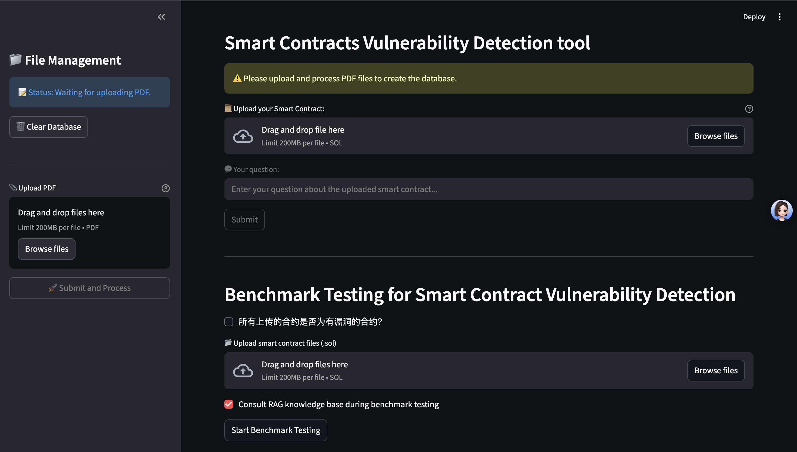
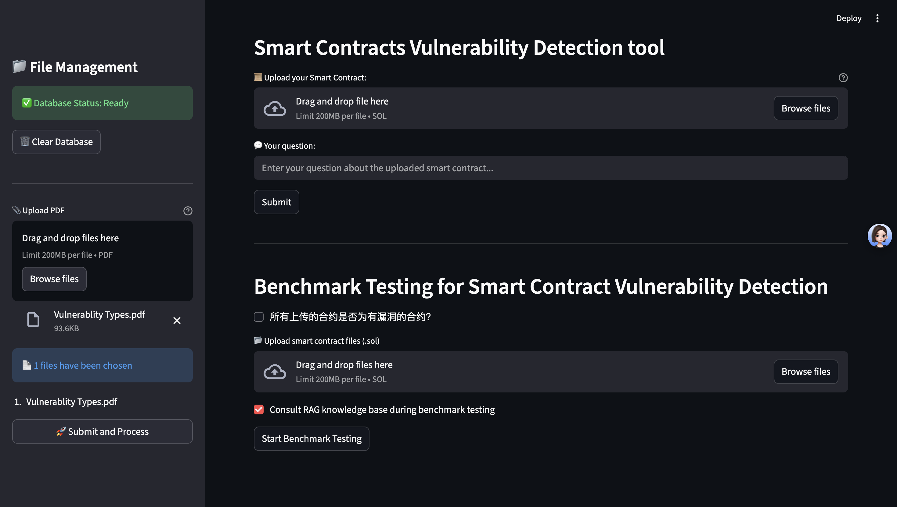
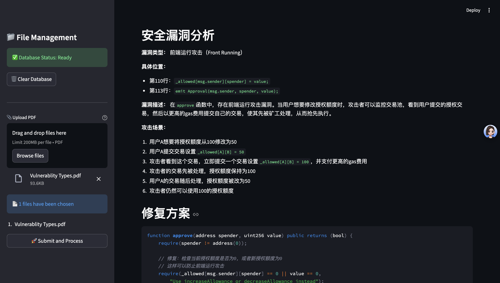
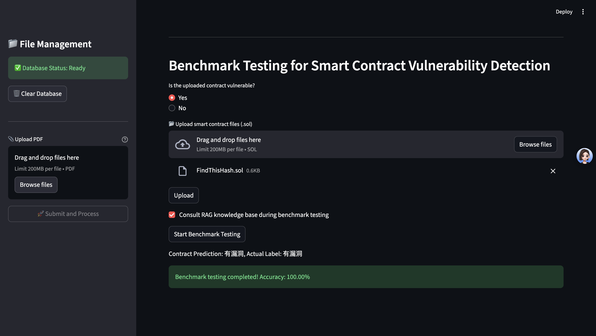

# Smart Contracts Vulnerability Detection Tool

- [中文文档](README_zh.md)
- [English Documentation](README_en.md)

## 项目简介

该项目是一个智能合约漏洞检测工具，旨在通过机器学习和知识库检索技术，帮助开发者识别和修复智能合约中的潜在漏洞。该工具支持上传智能合约代码，并提供基准测试功能，以评估模型的准确性。

## 功能

- **智能合约上传**：支持上传 `.sol` 格式的智能合约文件。
- **漏洞检测**：通过集成的 RAG（Retrieval-Augmented Generation）模型，自动检测合约中的漏洞。
- **基准测试**：支持对上传的合约进行基准测试，评估模型的准确率。
- **知识库查询**：在检测过程中，可以选择是否查阅 RAG 知识库以提高检测准确性。

## 技术栈

- Python
- Streamlit
- Langchain
- PyPDF2
- FAISS
- DashScope

## 安装

1. 克隆该项目：

   ```bash
   git clone https://github.com/cjsmt/SCVD-Agent.git
   cd SCVD-Agent
   ```

2. 创建并激活虚拟环境：
   
   ```bash
   python -m venv venv
   source venv/bin/activate  # 在 macOS/Linux 上
   venv\Scripts\activate  # 在 Windows 上
   ```

3. 安装依赖：
   ```bash
   pip install -r requirements.txt
   ```

4. 设置环境变量：
   创建一个 .env 文件，并添加以下内容：
   ```bash
   DASHSCOPE_API_KEY=your_dashscope_api_key
   DEEPSEEK_API_KEY=your_deepseek_api_key
   ```

## 使用

1. 启动应用：
   ```bash
   streamlit run main.py
   ```
2. 在浏览器中打开 http://localhost:8501。
   

3. 首先上传数据库，记载常见智能合约漏洞类型的PDF文件。
   

4. 上传智能合约文件并输入问题，点击提交以获取检测结果。
   
   

5. 使用基准测试功能，首先在你的工作目录存在test_dataset文件夹，并存在safe和vulnerable两个子文件夹。
   ```bash
   mkdir test_database
   cd test_database
   mkdir safe vulnerable
   ```

6. 将安全无漏洞的智能合约代码存放到test_dataset/safe目录下，将有漏洞的代码存放到test_dataset/vulnerable目录下。
7. 也可以在工具界面拖拽上传所要测试的智能合约代码，注意勾选是否“vulnerable”选项，
8. 点击Start Benchmark Testing即可完成基准测试
   